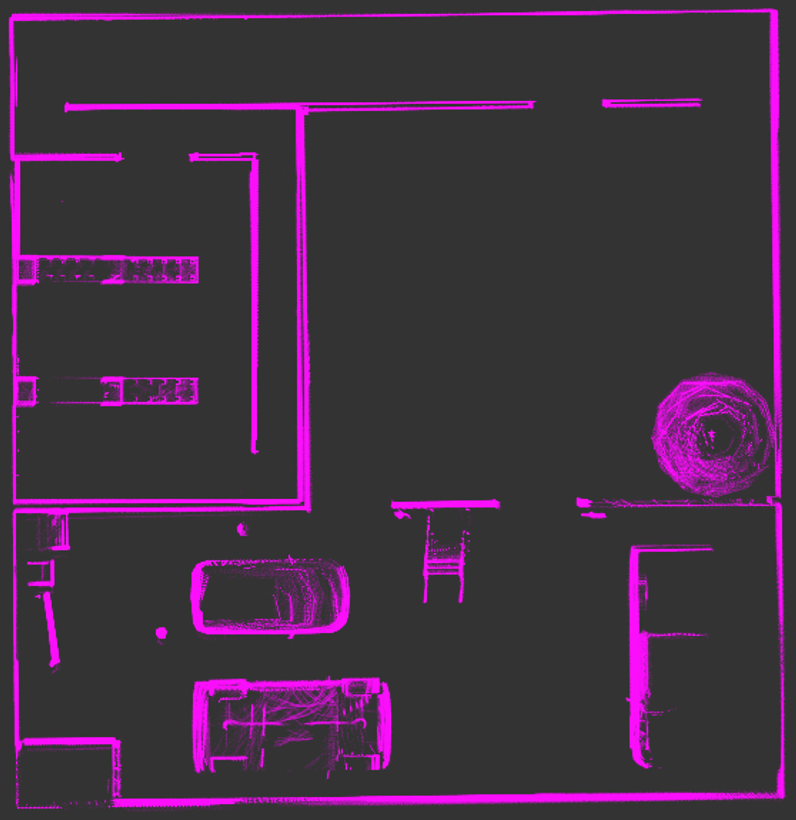
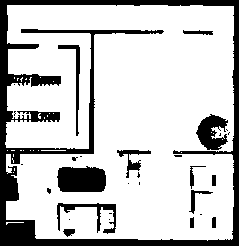
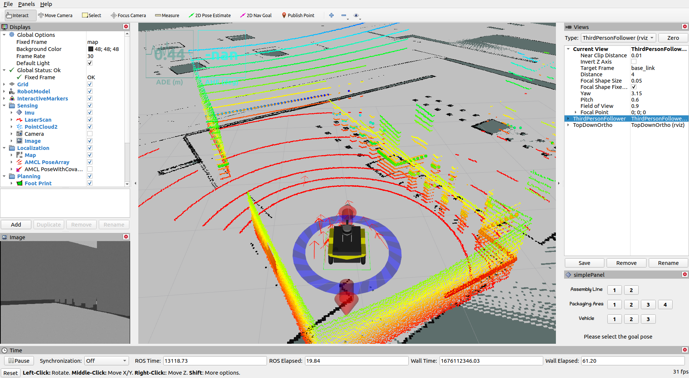

# ME5413 Final Project - Group 8

## Structure

```shell
.
├── final_fsm
├── final_percep # Perception package
├── final_pnc # Navigation package
├── final_slam # SLAM package
├── final_fsm # Finite State Machine package
├── interactive_tools
├── jackal
├── jackal_description
├── me5413_world
└── third_party
```

## General Installation

```shell
sudo apt install ros-noetic-rviz-imu-plugin ros-noetic-move-base ros-noetic-navfn tmux python3-catkin-tools zsh python3-wstool python3-rosdep ninja-build stow
```

Python dependencies

```shell
python -m pip install Pillow markupsafe==1.1.1 ipdb
```

### Building
```shell
mkdir -p ~/ME5413_final_ws/src
cd ~/ME5413_final_ws/
git clone https://github.com/brian00715/ME5413_Final_Project src

catkin config -DPYTHON_EXECUTABLE=/usr/bin/python3 -DCMAKE_BUILD_TYPE=Release

catkin build final_slam final_pnc final_percep final_fsm jackal* interactive_tools me5413_world 
```

### Perception using conda

```shell
conda create -n me5413 python=3.8
conda activate me5413
conda install pytorch==2.1.1 torchvision==0.16.1 pytorch-cuda=12.1 -c pytorch -c nvidia
conda install -c conda-forge opencv rosdep rospkg easyocr decorator pexpect numpy defusedxml ipdb
export PYTHONPATH=$PYTHONPATH:/usr/lib/python3.8/dist-packages
```
## SLAM Installation
### 1. Cartographer 
Please open a terminal in your workspace and execute the following commands to install Cartographer.

#### Install Cartographer Dependencies

```shell
sudo rosdep init
rosdep update
rosdep install --from-paths src --ignore-src --rosdistro=${ROS_DISTRO} -y
```

#### Install Abseil-cpp Library

Cartographer requires the `abseil-cpp` library, which needs to be manually installed using the provided script. Run the `install_abseil.sh` script:

```shell
~/your_workspace/src/ME5413_Final_Project/third_party/cartographer/cartographer/scripts/install_abseil.sh
```

#### Build and Install

Build Cartographer ROS and install it:

```shell
catkin build
```

After completing these steps, Cartographer ROS should be successfully installed on your system. You can activate it by running:

```shell
roslaunch final_slam mapping_carto.launch # default Mapping configuration
roslaunch final_slam mapping_carto_2d.launch # 2D Cartographer Mapping
roslaunch final_slam mapping_carto_3d.launch # 3D Cartographer Mapping
```

An example mapping by 2D Cartographer is shown as follows:

<p align="center">
    
</p>

### 2. Fast-LIO
Fast-LIO relies on `Livox-SDK` and `livox_ros_driver`, please satisify prerequisites first before compile `Fast-LIO`.


For **Ubuntu 18.04 or higher**, with **ROS >= Melodic**, the **default** PCL and Eigen is enough for FAST-LIO to work normally.

#### **Livox-SDK**
`Livox SDK` is the software development kit designed for all Livox products and required by Fast-LIO. To install and compile the SDK, 
please follow:

```shell
cd ~/your_workspace/src/ME5413_Final_Project/third_party/Livox-SDK
cd build && cmake ..
make
sudo make install
```

#### **livox_ros_driver**
`livox_ros_driver` is a ROS package used to connect LiDAR products produced by Livox, and is necessary for Fast-LIO. This package can be compiled by running

```shell
cd ~/your_workspace
catkin build livox_ros_driver
```

#### Build and run Fast-LIO
If all the prerequisites are satisfied, Fast-LIO can be easily complied by running

```shell
cd ~/your_workspace
catkin build fast_lio
```

To utilize Fast-LIO for mapping, execute the following commands:

```shell
source ~/your_workspace/devel/setup.bash
roslaunch final_slam mapping_fast_lio.launch
```

An point cloud example is shown as follows:

<p align="center">
    
</p>


#### Point Cloud to Map
After mapping with Fast-LIO, we offer a ROS package called `pcd2pgm` to convert the `.pcd` files generated by Fast-Lio (located in '**/src/third_party/FAST_LIO/PCD**') into standard `.pgm` map files. To compile this package, please execute:


```shell
cd ~/your_workspace
catkin build pcd2pgm
```

To generate the map, run the following command:

```shell
source ~/your_workspace/devel/setup.bash
roslaunch pcd2pgm pcd2pgm.launch
```

After seeing '**data size =**' displayed in the terminal, open a new terminal in your map folder and execute:

```shell
rosrun map_server map_saver
```

Then you can obtain the `.pgm` map file. An example is shown as follows:

<p align="center">
    
</p>

### 3. Map Fusion
To fully utilize the information from maps obtained by Cartographer and Fast-LIO respectively, we provide a simple Python script with image processing methods to fuse these two high-quality maps into one. To perform this fusion, execute:

```shell
cd ~/your_workspace/src/final_slam/scripts
chmod +x map_fusion.py
python3 map_fusion
```

You will obtain the fused map named 'fusion_map.pgm' in '**/final_slam/map**'. The result is shown as follows:

<p align="center">
    
</p>


## Running

### One-click launch

```shell
rosrun final_fsm start.sh
```

### Step-by-step launch

- mapping

```shell
roslaunch me5413_world world.launch
roslaunch final_slam mapping_carto.launch
```

- localization

```shell
roslaunch final_slam localization_carto.launch
```

- navigation(with finate state machine)

```shell
roslaunch me5413_world world.launch
roslaunch final_fsm fsm.launch
```

- navigation

```shell
roslaunch final_pnc navigation.launch
```

# API

## `nmpc_node`

### Subscribed Topics

### Published Topics

## State Machine

---

# BELOW IS THE ORIGINAL `readme` FILE

# ME5413_Final_Project

NUS ME5413 Autonomous Mobile Robotics Final Project

> Authors: [Christina](https://github.com/ldaowen), [Yuhang](https://github.com/yuhang1008), [Dongen](https://github.com/nuslde), and [Shuo](https://github.com/SS47816)


## Dependencies

- System Requirements:
  - Ubuntu 20.04 (18.04 not yet tested)
  - ROS Noetic (Melodic not yet tested)
  - C++11 and above
  - CMake: 3.0.2 and above
- This repo depends on the following standard ROS pkgs:
  - `roscpp`
  - `rospy`
  - `rviz`
  - `std_msgs`
  - `nav_msgs`
  - `geometry_msgs`
  - `visualization_msgs`
  - `tf2`
  - `tf2_ros`
  - `tf2_geometry_msgs`
  - `pluginlib`
  - `map_server`
  - `gazebo_ros`
  - `jsk_rviz_plugins`
  - `jackal_gazebo`
  - `jackal_navigation`
  - `velodyne_simulator`
  - `teleop_twist_keyboard`
- And this [gazebo_model](https://github.com/osrf/gazebo_models) repositiory

## Installation

This repo is a ros workspace, containing three rospkgs:

- `interactive_tools` are customized tools to interact with gazebo and your robot
- `jackal_description` contains the modified jackal robot model descriptions
- `me5413_world` the main pkg containing the gazebo world, and the launch files

**Note:** If you are working on this project, it is encouraged to fork this repository and work on your own fork!

After forking this repo to your own github:

```bash
# Clone your own fork of this repo (assuming home here `~/`)
cd
git clone https://github.com/<YOUR_GITHUB_USERNAME>/ME5413_Final_Project.git
cd ME5413_Final_Project

# Install all dependencies
rosdep install --from-paths src --ignore-src -r -y

# Build
catkin_make
# Source
source devel/setup.bash
```

To properly load the gazebo world, you will need to have the necessary model files in the `~/.gazebo/models/` directory.

There are two sources of models needed:

- [Gazebo official models](https://github.com/osrf/gazebo_models)

  ```bash
  # Create the destination directory
  cd
  mkdir -p .gazebo/models

  # Clone the official gazebo models repo (assuming home here `~/`)
  git clone https://github.com/osrf/gazebo_models.git

  # Copy the models into the `~/.gazebo/models` directory
  cp -r ~/gazebo_models/* ~/.gazebo/models
  ```

- [Our customized models](https://github.com/NUS-Advanced-Robotics-Centre/ME5413_Final_Project/tree/main/src/me5413_world/models)

  ```bash
  # Copy the customized models into the `~/.gazebo/models` directory
  cp -r ~/ME5413_Final_Project/src/me5413_world/models/* ~/.gazebo/models
  ```

## Usage

### 0. Gazebo World

This command will launch the gazebo with the project world

```bash
# Launch Gazebo World together with our robot
roslaunch me5413_world world.launch
```

### 1. Manual Control

If you wish to explore the gazebo world a bit, we provide you a way to manually control the robot around:

```bash
# Only launch the robot keyboard teleop control
roslaunch me5413_world manual.launch
```

**Note:** This robot keyboard teleop control is also included in all other launch files, so you don't need to launch this when you do mapping or navigation.


### 2. Mapping

After launching **Step 0**, in the second terminal:

```bash
# Launch GMapping
roslaunch me5413_world mapping.launch
```

After finishing mapping, run the following command in the thrid terminal to save the map:

```bash
# Save the map as `my_map` in the `maps/` folder
roscd me5413_world/maps/
rosrun map_server map_saver -f my_map map:=/map
```


### 3. Navigation

Once completed **Step 2** mapping and saved your map, quit the mapping process.

Then, in the second terminal:

```bash
# Load a map and launch AMCL localizer
roslaunch me5413_world navigation.launch
```



## Student Tasks

### 1. Map the environment

- You may use any SLAM algorithm you like, any type:
  - 2D LiDAR
  - 3D LiDAR
  - Vision
  - Multi-sensor
- Verify your SLAM accuracy by comparing your odometry with the published `/gazebo/ground_truth/state` topic (`nav_msgs::Odometry`), which contains the gournd truth odometry of the robot.
- You may want to use tools like [EVO](https://github.com/MichaelGrupp/evo) to quantitatively evaluate the performance of your SLAM algorithm.

### 2. Using your own map, navigate your robot

- From the starting point, move to the given pose within each area in sequence
  - Assembly Line 1, 2
  - Random Box 1, 2, 3, 4
  - Delivery Vehicle 1, 2, 3
- We have provided you a GUI in RVIZ that allows you to click and publish these given goal poses to the `/move_base_simple/goal` topic:

  

- We also provides you four topics (and visualized in RVIZ) that computes the real-time pose error between your robot and the selelcted goal pose:
  - `/me5413_world/absolute/heading_error` (in degrees, wrt `world` frame, `std_msgs::Float32`)
  - `/me5413_world/absolute/position_error` (in meters, wrt `world` frame, `std_msgs::Float32`)
  - `/me5413_world/relative/heading_error` (in degrees, wrt `map` frame, `std_msgs::Float32`)
  - `/me5413_world/relative/position_error` (in meters wrt `map` frame, `std_msgs::Float32`)

## Contribution

You are welcome contributing to this repo by opening a pull-request

We are following:

- [Google C++ Style Guide](https://google.github.io/styleguide/cppguide.html),
- [C++ Core Guidelines](https://isocpp.github.io/CppCoreGuidelines/CppCoreGuidelines#main),
- [ROS C++ Style Guide](http://wiki.ros.org/CppStyleGuide)

## License

The [ME5413_Final_Project](https://github.com/NUS-Advanced-Robotics-Centre/ME5413_Final_Project) is released under the [MIT License](https://github.com/NUS-Advanced-Robotics-Centre/ME5413_Final_Project/blob/main/LICENSE)
````
