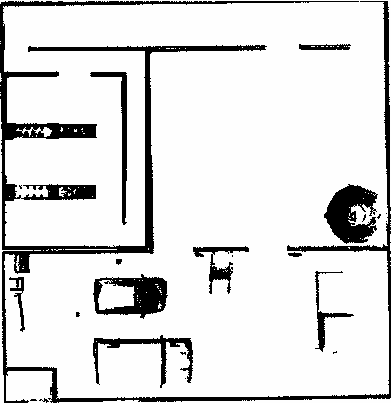

# NUS ME5413 Final Project - Group 8

Task Description: please refer to [./docs/ME5413_Final_Project.pdf](./docs/ME5413_Final_Project.pdf).

You can read our [report](./ME5413_Final_Report.pdf) for more details.

Demo:


For the insturcitons of the original simulation environment that this project relies on, please refer to [ME5413_Final_Project-Github](https://github.com/NUS-Advanced-Robotics-Centre/ME5413_Final_Project).

If you have any questions, please feel free to contact us: [smkk00715@gmail.com](mailto:smkk00715@gmail.com)

## Features

- SLAM
  - [X] Cartographer
  - [X] Fast-LIO2
  - [X] Map Fusion
- Planning and Control (PnC)
  - [X] A\*
  - [X] Theta\*
  - [X] DWA
  - [X] TEB
  - [X] Model Predictive Control (MPC)
- Perception: EasyOCR
- Decision and Exploration
  - [X] Finite State Machine (FSM)
  - [X] Frontier and occupancy grid map-based exploration
- Pipeline: Highly modular, automated, and configurable

## Structure

```shell
.
├── final_fsm # Finite State Machine package
├── final_percep # Perception package
├── final_pnc # Navigation package
├── final_slam # SLAM package
├── interactive_tools # Interactive tools for rviz
├── jackal # Jackal package
├── jackal_description # Modified Jackal model package
├── me5413_world # Gazebo simulation package
└── third_party # Third-party packages. We have modified or tailored some of them.
```

## Installation

### System dependencies

- Ubuntu 20.04
- ROS Noetic
- C++11 and above

```shell
sudo apt install ros-noetic-rviz-imu-plugin ros-noetic-move-base ros-noetic-navfn tmux python3-catkin-tools python3-wstool  python3-rosdep ninja-build stow ffmpeg lua5.2 liblua5.2-dev
sudo apt-get remove ros-${ROS_DISTRO}-abseil-cpp
python -m pip install Pillow markupsafe==2.0.1 jinja2 ipdb
```

- Some useful commands

  In your `.bashrc` or `.zshrc` file, add the following lines:

  ```shell
  alias rosk='rosnode kill -a ; killall -9 roscore rosmaster gzserver gazebo rviz ; kill -9 $(pgrep -f rqt)' # kill all ROS processes immediately
  alias gazebok="pkill -P $(pgrep -f gazebo.launch) ; pkill -9 gzserver ; pkill -9 gzclient" # kill gazebo immediately
  alias rqtg="rosrun rqt_graph rqt_graph"
  alias rqttf="rosrun rqt_tf_tree rqt_tf_tree"
  alias rqtrecon="rosrun rqt_reconfigure rqt_reconfigure"
  ```

### Repository setup

```shell
cd ~
git clone https://github.com/brian00715/Autonomous-Robot-Navigation me5413_final_ws
catkin init
catkin config -DPYTHON_EXECUTABLE=/usr/bin/python3 -DCMAKE_BUILD_TYPE=RelWithDebInfo

# package ros dependencies
rosdep install --from-paths src --ignore-src --rosdistro=noetic -y
```

Someone may encounter the issue that the RViz runs extremely slow when visualizing the point cloud. To accelerate the point cloud processing, you can edit the Velodyne description file:

```shell
roscd velodyne_description/urdf
```

Open the `VLP-16.urdf.xacro` and `HDL-32E.urdf.xacro`, change the `gpu:=false` to `gpu:=true` on line 4.

### 1. Build SLAM packages

> Note: You can choose to install the relied SLAM packages. No need to install all of them.

#### Cartographer (Recommended)

- Install Abseil-cpp Library

  ```shell
  ~/me5413_final_ws/src/third_party/cartographer/cartographer/scripts/install_abseil.sh
  ```
- Build:

  ```shell
  cd ~/me5413_final_ws
  catkin build cartographer*
  ```

#### Fast-LIO (optional)

- Build

  ```shell
  cd ~/me5413_final_ws
  catkin build fast_lio
  ```

### 2. Build extra packages

> Note: the SLAM packages should be built before this step.

```shell
catkin build final_slam final_pnc final_percep final_fsm jackal* interactive_tools me5413_world
echo "source ~/me5413_final_ws/devel/setup.bash" >> ~/.bashrc
bash
```

### Prepare perception packages (optional)

Please install `conda` first.

```shell
conda create -n me5413 python=3.8
conda activate me5413
conda install pytorch==2.1.1 torchvision==0.16.1 pytorch-cuda=12.1 -c pytorch -c nvidia
conda install -c conda-forge opencv rosdep rospkg easyocr decorator pexpect numpy defusedxml ipdb
export PYTHONPATH=$PYTHONPATH:/usr/lib/python3.8/dist-packages
```

## Running

### One-click launch

> Note: please confirm the conda environment and Cartographer have already been installed and built scuccessfully before running the one-click launch.

```shell
rosrun final_fsm start.sh
rosrun final_fsm start.sh -e -r # enable EKF and enable screen recording
```

You can simply kill all the programs immediately by running:

```
tmux kill-server
```

### Step-by-step launch

#### Gazebo simulation

```shell
export ENABLE_EKF=false # set to false means using the ground truth odometry, otherwise the EKF odometry fusing IMU the wheel odometry
roslaunch me5413_world me5413_world.launch
```

#### Mapping

- **Cartographer**

  ```shell
  roslaunch final_slam mapping_carto.launch # default Mapping configuration
  roslaunch final_slam mapping_carto_2d.launch # 2D Cartographer Mapping
  roslaunch final_slam mapping_carto_3d.launch # 3D Cartographer Mapping
  ```

  An example of mapping by 2D Cartographer is shown as follows:

  <p align="center">
      
  </p>
- **Fast-LIO**

  ```shell
  source ~/me5413_final_ws/devel/setup.bash
  roslaunch final_slam mapping_fast_lio.launch
  ```

  An example of point cloud by FastLIO is shown as follows:

  <p align="center">
      
  </p>

  - Point Cloud to Map

    After mapping with Fast-LIO, we offer a ROS package called `pcd2pgm` to convert the `.pcd` files generated by Fast-Lio (located in `src/third_party/FAST_LIO/PCD`) into standard `.pgm` map files. To compile this package, please execute:

    ```shell
    cd ~/me5413_final_ws
    catkin build pcd2pgm
    ```

    To generate the map, run the following command:

    ```shell
    source ~/me5413_final_ws/devel/setup.bash
    roslaunch pcd2pgm pcd2pgm.launch
    ```

    After seeing '**data size =**' displayed in the terminal, open a new terminal in your map folder and execute:

    ```shell
    rosrun map_server map_saver
    ```

    Then you can obtain the `.pgm` map file. An example is shown as follows:

    <p align="center">
        
    </p>
- **Map Fusion**

  To fully utilize the maps generated both by Cartographer and Fast-LIO, we provide a simple Python script that uses image processing methods to fuse these two high-quality maps into one. To perform this, execute:

  ```shell
  cd ~/me5413_final_ws/src/final_slam/scripts
  chmod +x map_fusion.py
  python3 map_fusion
  ```

  You will obtain the fused map named `fusion_map.pgm` in `final_slam/maps`. The result is shown as follows:

  <p align="center">
        
  </p>

#### Localization (With built map)

```shell
roslaunch final_slam localization_carto.launch # cartographer by default
```

#### Navigation

- With Gazebo, cartographer, and navigation

  ```shell
  rosrun final_pnc debug.sh
  ```
- Only navigation

  ```shell
  roslaunch final_pnc pnc.launch
  ```

#### FSM

```shell
roslaunch final_fsm fsm.launch
```

## Configuration

### Localization

To change to map used for localization, modify the `map_file` parameter in `final_slam/launch/localization_carto.launch`.

### Planning and control

You can choose which global planner or local planner to use in `final_pnc/launch/pnc.launch`.

> Note: For the current version, if you want to use the DWA or TEB local planner, you should set arg `local_planner` to a value other than `mpc`. Uncomment the corresponding local planner from lines 40-47 and comment out lines 49-50 in `final_pnc/launch/pnc.launch`.

You can modify the parameters in `final_pnc/config/*/*.yaml` to adjust the performance. For exmaple, you can adjust the `max_vel` in `final_pnc/config/nav_params/mpc.yaml` to change the maximum velocity of MPC local planner.

# Acknowledgement

We would like to thank the following open-source projects:

- [ME5413_Final_Project](https://github.com/NUS-Advanced-Robotics-Centre/ME5413_Final_Project)
- [Cartographer](https://github.com/cartographer-project/cartographer)
- [Fast-LIO](https://github.com/hku-mars/FAST_LIO)
- [ros_motion_planning](https://github.com/ai-winter/ros_motion_planning)
- [pcd2pgm_package](https://github.com/Hinson-A/pcd2pgm_package)
- [PA-DMPC-UAV-Ad-Hoc](https://github.com/brian00715/PA-DMPC-UAV-Ad-Hoc)
- [EasyOCR](https://github.com/JaidedAI/EasyOCR)
- [occ_grid_mapping](https://github.com/ydsf16/occ_grid_mapping/)

---
