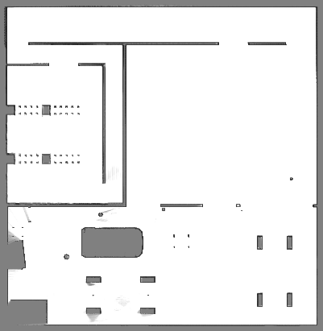
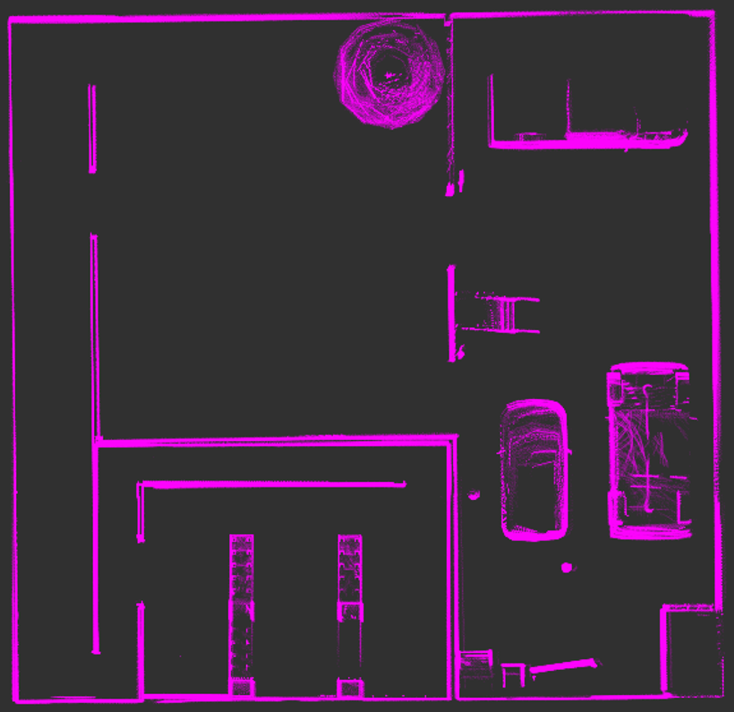
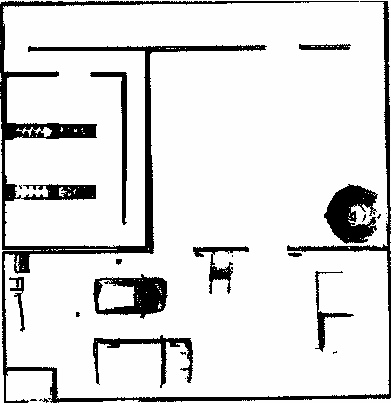
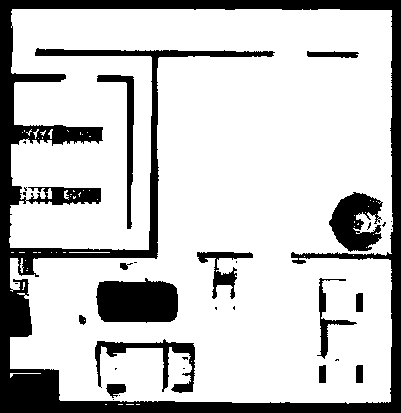

# ME5413 Final SLAM
The ROS package '`final_slam`' contains SLAM algorithms utilized in the ME5413 Final Project by Group 8.

## Cartographer 
Please open a terminal in your workspace and execute the following commands to install Cartographer.

### Install Required Tools

```shell
sudo apt-get update
sudo apt-get install -y python3-wstool python3-rosdep ninja-build stow
```

### Install Cartographer Dependencies

```shell
sudo rosdep init
rosdep update
rosdep install --from-paths src --ignore-src --rosdistro=${ROS_DISTRO} -y
```

### Install Abseil-cpp Library

Cartographer requires the `abseil-cpp` library, which needs to be manually installed using the provided script. Run the `install_abseil.sh` script:

```shell
~/your_workspace/src/ME5413_Final_Project/third_party/cartographer/cartographer/scripts/install_abseil.sh
```

### Build and Install

Build Cartographer ROS and install it:

```shell
catkin build
```

After completing these steps, Cartographer ROS should be successfully installed on your system. You can activate it by running:

```shell
roslaunch final_slam mapping_carto.launch # default Mapping configuration
roslaunch final_slam mapping_carto_2d.launch # 2D Cartographer Mapping
roslaunch final_slam mapping_carto_3d.launch # 3D Cartographer Mapping
```

An example mapping by 2D Cartographer is shown as follows:

<p align="center">
    
</p>

## Fast-LIO
Fast-LIO relies on `Livox-SDK` and `livox_ros_driver`, please satisify prerequisites first before compile `Fast-LIO`.

### 1. Prerequisites
For **Ubuntu 18.04 or higher**, with **ROS >= Melodic**, the **default** PCL and Eigen is enough for FAST-LIO to work normally.

#### **Livox-SDK**
`Livox SDK` is the software development kit designed for all Livox products and required by Fast-LIO. To install and compile the SDK, 
please follow:

```shell
cd ~/your_workspace/src/ME5413_Final_Project/third_party/Livox-SDK
cd build && cmake ..
make
sudo make install
```

#### **livox_ros_driver**
`livox_ros_driver` is a ROS package used to connect LiDAR products produced by Livox, and is necessary for Fast-LIO. This package can be compiled by running

```shell
cd ~/your_workspace
catkin build livox_ros_driver
```

### 2 Build and running Fast-LIO
If all the prerequisites are satisfied, Fast-LIO can be easily complied by running

```shell
cd ~/your_workspace
catkin build fast_lio
```

To utilize Fast-LIO for mapping, execute the following commands:

```shell
source ~/your_workspace/devel/setup.bash
roslaunch final_slam mapping_fast_lio.launch
```

An point cloud example is shown as follows:

<p align="center">
    
</p>


### 3 Point Cloud to Map
After mapping with Fast-LIO, we offer a ROS package called `pcd2pgm` to convert the `.pcd` files generated by Fast-Lio (located in '**/src/third_party/FAST_LIO/PCD**') into standard `.pgm` map files. To compile this package, please execute:


```shell
cd ~/your_workspace
catkin build pcd2pgm
```

To generate the map, run the following command:

```shell
source ~/your_workspace/devel/setup.bash
roslaunch pcd2pgm pcd2pgm.launch
```

After seeing '**data size =**' displayed in the terminal, open a new terminal in your map folder and execute:

```shell
rosrun map_server map_saver
```

Then you can obtain the `.pgm` map file. An example is shown as follows:

<p align="center">
    
</p>

## Map Fusion
To fully utilize the information from maps obtained by Cartographer and Fast-LIO respectively, we provide a simple Python script with image processing methods to fuse these two high-quality maps into one. To perform this fusion, execute:

```shell
cd ~/your_workspace/src/final_slam/scripts
chmod +x map_fusion.py
python3 map_fusion
```

You will obtain the fused map named 'fusion_map.pgm' in '**/final_slam/map**'. The result is shown as follows:

<p align="center">
    
</p>